# Architecture

## Executive Summary
This platform is designed as a **modular monolith with microservice-ready boundaries**. It optimizes delivery speed for an interview/reference context while preserving strong bounded-context isolation for future extraction.

## Bounded Contexts
1. Identity & Client
2. Wallet & Custody
3. Market Data
4. Order Management
5. Execution Gateway
6. Settlement
7. Blockchain Monitoring
8. Risk & Compliance
9. Reconciliation
10. Observability & Audit

## C4 - Context Diagram
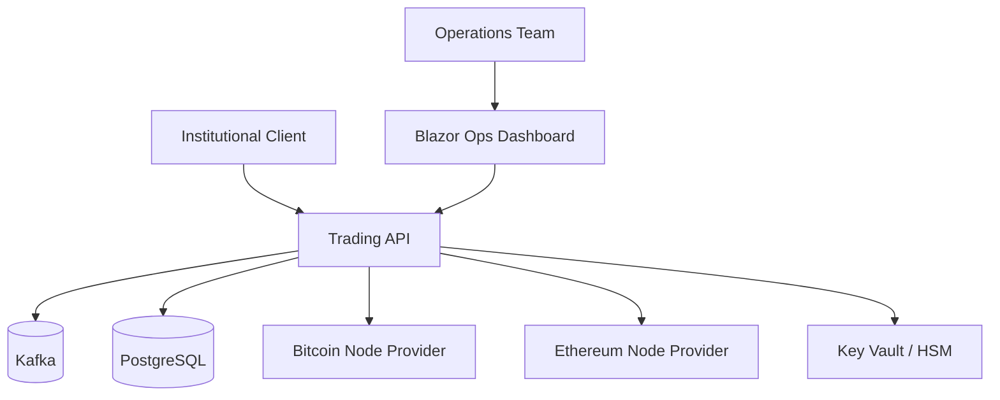

## C4 - Container Diagram
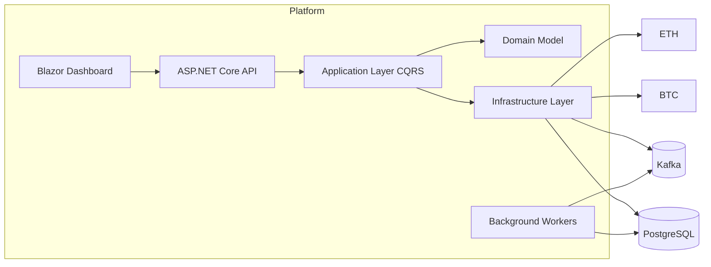

## C4 - Component Diagram (Trading + Custody)
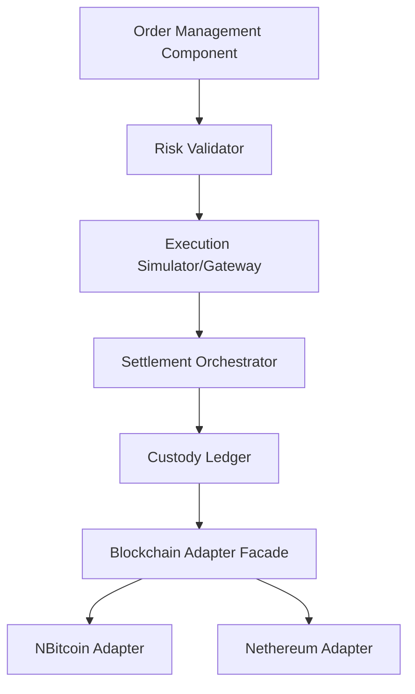

## Sequence - Order Lifecycle
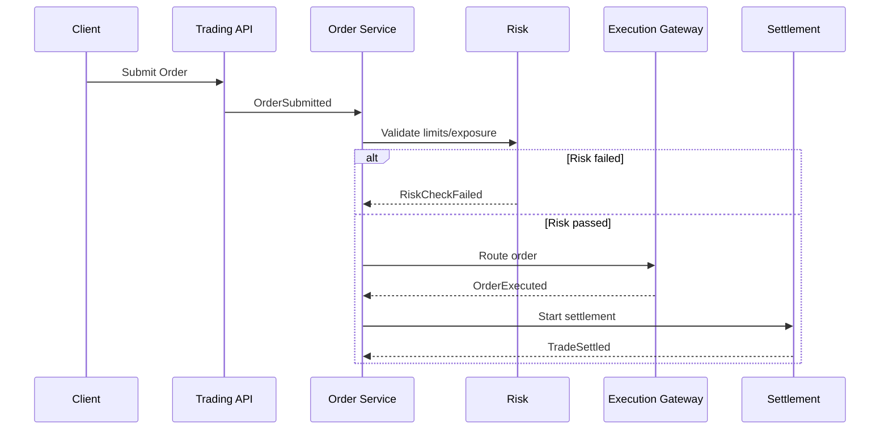

## Sequence - Deposit Workflow
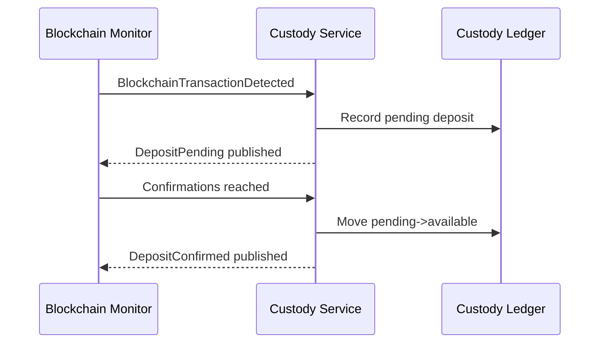

## Sequence - Withdrawal Workflow
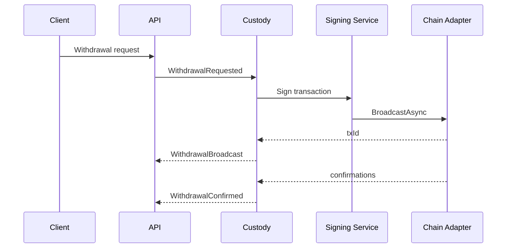

## Sequence - Settlement Workflow
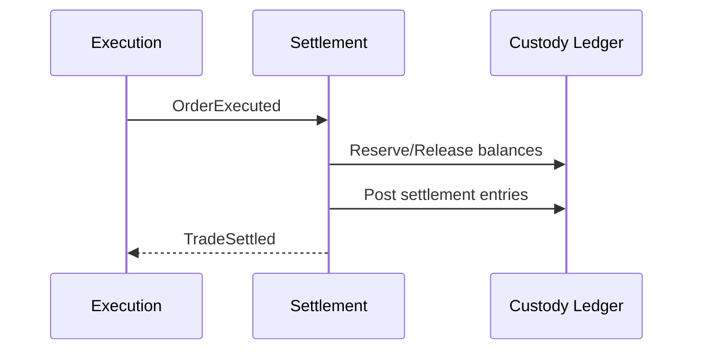

## Sequence - Blockchain Monitoring
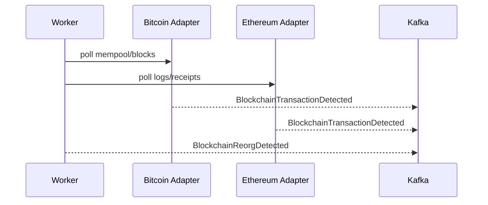

## Sequence - Reconciliation
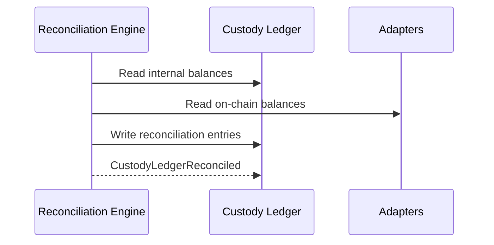

## Sequence - Risk Validation
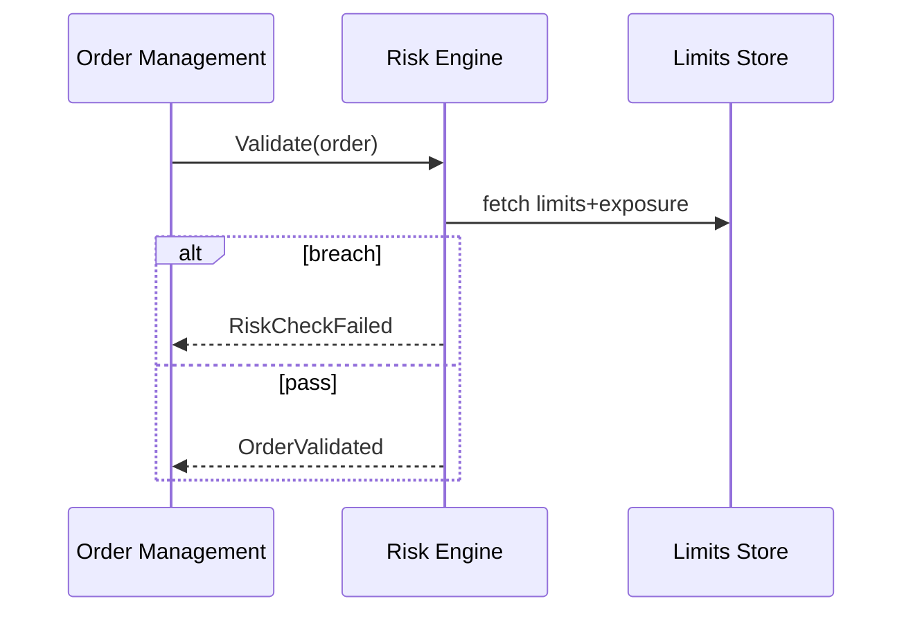

## Infrastructure Diagrams
### Azure Topology
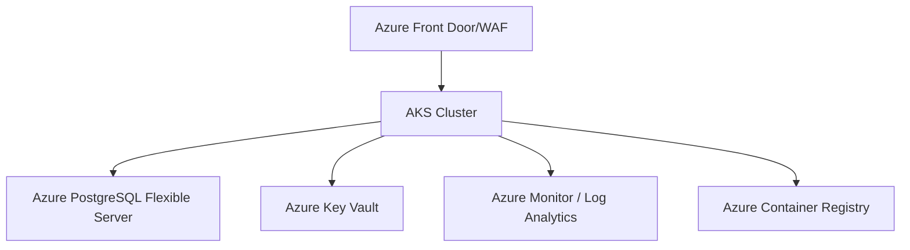

### Kubernetes Topology
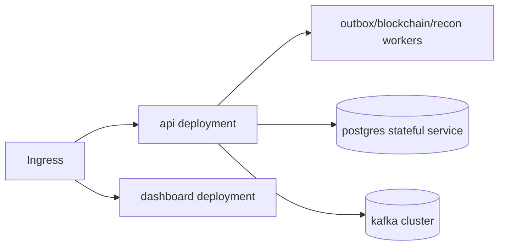

### Kafka Event Topology
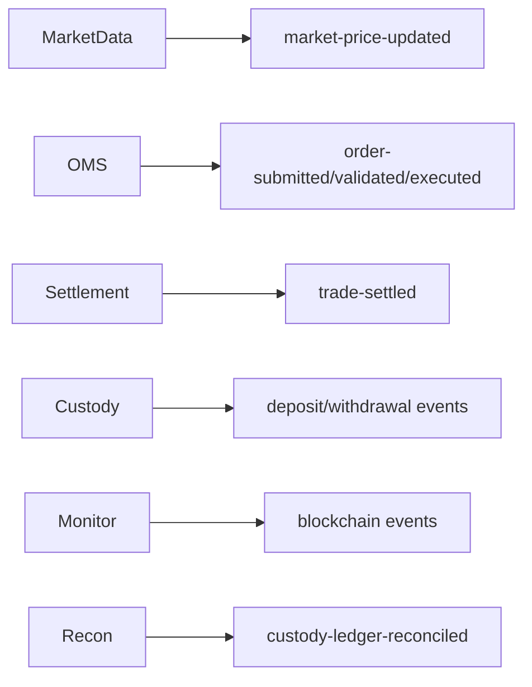

### Multi-chain Adapter
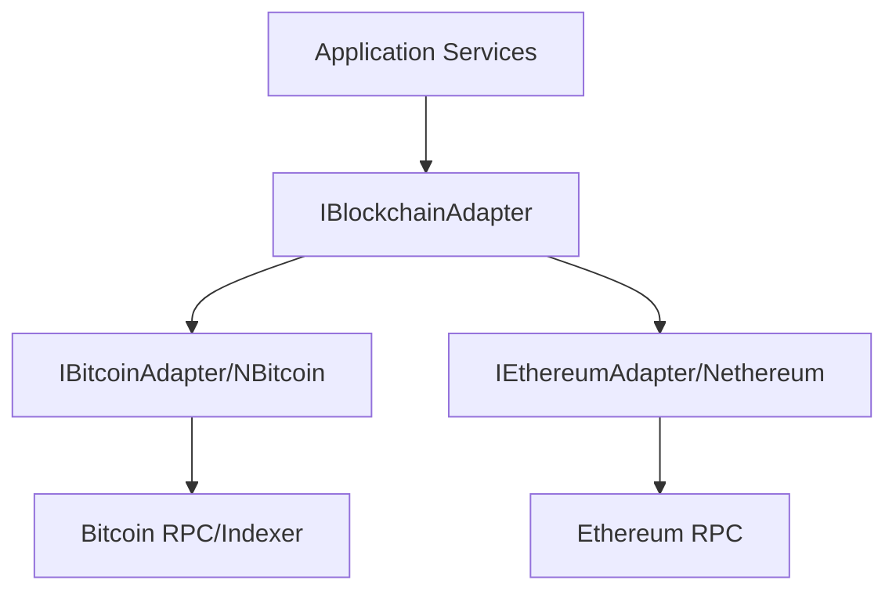

### Hot/Cold Wallet Architecture
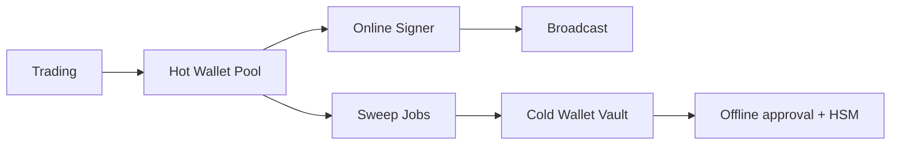
